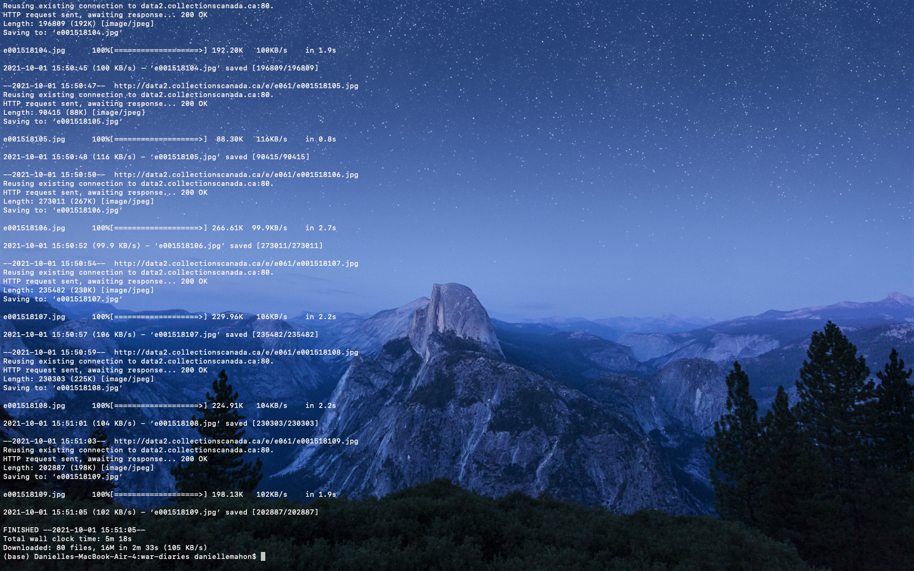
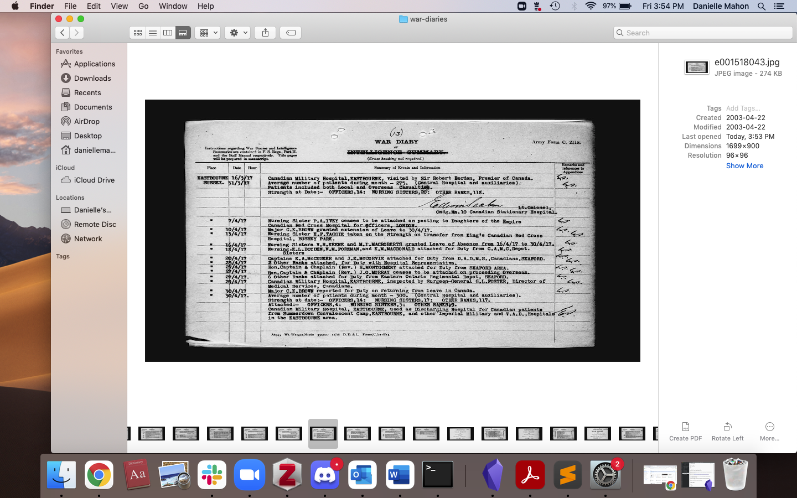

# what I was trying to do

My goal was to work through the steps in Dr. Graham's tutorial to see if I could download URL data from web archives.

Relevant tutorial: [WGET tutorial](https://graddh.netlify.app/docs/tutorials/wget/)

___

## how it might connect to other research I'm doing

My research focus is African Nova Scotian history, mostly in reference to twentieth-century urban redevelopment and displacement. Methodologically, I'm interested in mapping, heritage preservation efforts, oral history, and digital storytelling using soundscapes. 

WGET could help my research by pulling text files, like oral history transcripts and newspaper articles, as well as industrial zoning maps of Halifax in the early twentieth century. I'm also interested in pulling audiofiles - either oral history clips or historical sounds from the mid-century - and I believe WGET can accomodate multimedia files, but I have yet to experiment with those files.

---

## what I did

+ step 1  
	+ I installed Homebrew, then downloaded WGET using HomeBrew since it's not available as its own repository.
+ step 2
	+ Completed the two options for running WGET
		+ Using WGET to pull URLS
		+ Using python to generate URLS, and WGET to pull once generated.
+ step 3
	+ After a few attempts, I was able to pull both repositories of primary source documents.

Screenshots of the code and file pulled:

---

## challenges 

I found the tutorial to be pretty straight forward, however I had issues using the command for the python generated URLS initially. This problem was because I had not put the python file and text file in the same directory as my war-diaries folder.

So I would get an error message: *command not found*

This was because I was in my desktop directory when I should have been in my base directory. Once I went back a little (using the command line prompt `cd ..`) I was able to pull the text file.

___

## thoughts on where to go next

I'd like to try WGET for audiofiles or video files, which might be do-able just using the URL pull commands. I've added another blog post that might be helpful for my future self: https://adamtheautomator.com/python-wget/#Installing_and_Activating_Virtual_Environment
